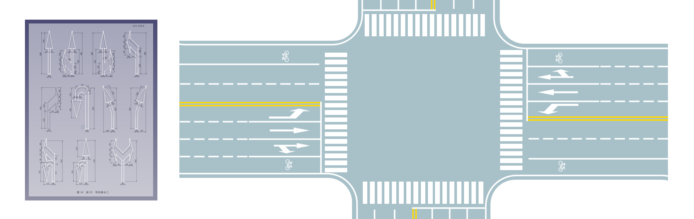
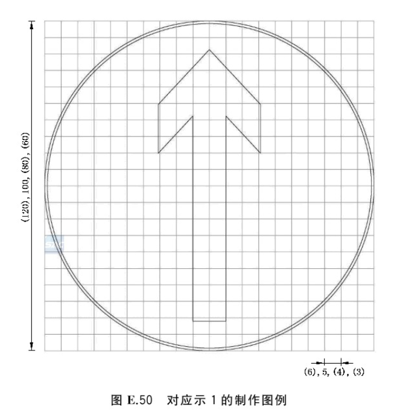
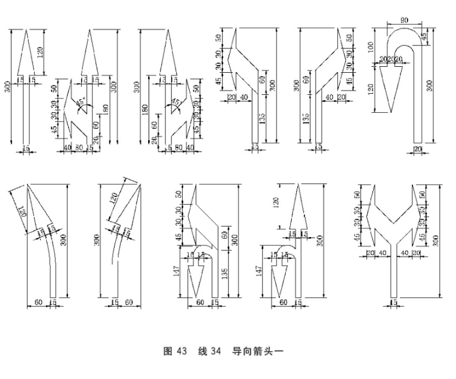

# GB-road-svg
中国国标道路标志和标线矢量图
## 目的与原则

本项目旨在针对**GB** 5768系列标准中规范的道路图形进行绘制，并尽可能保持以下原则：
1. **标准化**：确保绘制图形与标准的一致性，包括但不限于尺寸、形状、颜色、字体等。
2. **参数化**：满足标准所规定的图形内部结构的参数化要求，包括但不限于共点、共线、平行、垂直、角度、长度等。
3. **矢量化**：所绘制图形均为矢量图，适合任意比例放缩。
从而使的最终图片可准确、统一地应用于PPT展示、三维模型、甚至作为数据集真值等等用途。

## 绘制流程与标准
5768系列标准对图案轮廓的规定主要分为两种：
第一种为放样式（如下图）
第二种为参数式（如下图）

为了达到前述的三项目的，此本项目中的图形首先使用[FreeCAD](https://www.freecadweb.org/)中的[SKetcher](https://wiki.freecadweb.org/Sketcher_Workbench)进行参数化绘制，并通过`Flattened SVG`输出为``xxxx.svg``的矢量轮廓；再使用[inkscape](https://inkscape.org/)进行上色，输出为``xxxx-colored.svg``。
对于绘制图片为放样式的，使用图片叠片后使用样条曲线进行放样绘制；
对于参数式的图样，则使用约束工具对几何关系进行约束。**值得注意的是，标准中部分参数化约束并不完全。在这种情况下命名会以特定的标志位进行标记，提醒用户该图形可能并不唯一。**

## 文件组织与命名
- 按照标准编号-二级标题序号进行文件夹划分，即最小文件夹为某标准的某一二级标题序号。此目录结构应该是显而易见的。
- 同一个目录下不再划分子目录。源文件与输出结果文件靠文件名区分。
    - 对于源文件，命名为：`<标准号>-<年份>-<二级章节号>-<符号组编号>.FCStd`。
    - 结果图像命名为：`<标准号>-<年份>-<二级章节号>-<符号编号>_<中文名称>(_U,如果该图像欠约束)(-colored,如果是上色版本).svg`